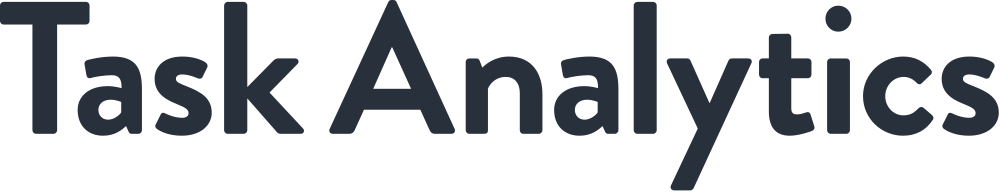
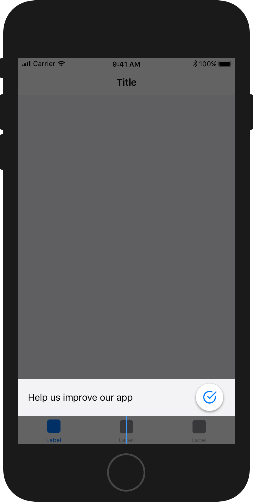
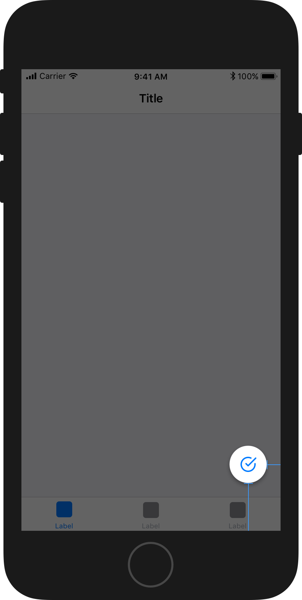

# Task Analytics iOS SDK

[](http://cocoapods.org/pods/TaskAnalytics)
[](http://cocoapods.org/pods/TaskAnalytics)
[](http://cocoapods.org/pods/TaskAnalytics)

## Example

To run the example project, clone the repo, and run `pod install` from the Example directory first.

## Requirements

- iOS 10.0, or newer
- Task Analytics ID, contact us at hello@taskanalytics.com to obtain one.

## Installation

TaskAnalytics is available through [CocoaPods](http://cocoapods.org). To install
it, simply add the following line to your Podfile:

```ruby
pod 'TaskAnalytics'
```

## Setup

To start using the SDK, you need to have an ID provided by Task Analytics.

Then, import the Task Analytics framework in your UIApplicationDelegate subclass:

```objective-c
@import TaskAnalytics;
```

Configure the Task Analytics shared instance, typically in your application's ```application:didFinishLaunchingWithOptions: method:```

```objective-c
[TaskAnalytics.sharedInstance setupWithID:YOUR_TASK_ANALYTICS_ID];
```

## Usage

### Placements of buttons

The placements of buttons should be done at least once, preferably during setup. It is also possible to move the buttons later. 

#### Consent button



The consent button spans the full width of the screen. It can be placed in a vertical distance from the top or bottom edge.

```objective-c
[TaskAnalytics.sharedInstance setConsentButtonVerticalDistance:(float)verticalDistance fromEdge:(TAEdge)edge];
```

If you run this method after the consent button is displayed, it will animate into the new position. This way, can you move it if it obstructs important content in your app.

When the user clicks on the consent button, a full screen modal view will be displayed where the user is asked to accept or decline the use of Task Analytics. The user can close the modal view without answering. In that case, the consent button remains in place.


#### Launcher button



The launcher button is a round button showing your avatar. It can be placed a certain number of points on the horizontal and vertical distance from one of the four screen corners.

If you run this method after the consent button is displayed, it will animate into the new position. This way, can you move it if it obstructs important content in your app.

```objective-c
[TaskAnalytics.sharedInstance setLauncherButtonHorizontalDistance:(float)horizontalDistance verticalDistance:(float)verticalDistance fromCorner:(TACorner)corner];
```

When the user clicks on the launcher button, a full screen modal view will be displayed where the user continues answering questions about their usage of your app. The user can close the modal view without answering. In that case, the launcher button remains in place.


### Show

When you're ready to show Task Analytics, run

```objective-c
[TaskAnalytics.sharedInstance show];
```
Whether or not the Task Analytics will be displayed will be determined by the server.

### Hide

If you have views in your app where you don't want to show Task Analytics, you can hide it using:

```objective-c
[TaskAnalytics.sharedInstance hide];
```


## Callbacks

There are severall call backs available through ```TaskAnalyticsDelegate```. These will typically be used if you want to integrate Task Analytics with your own analytics tools.

- consentButtonPressed
- closeButtonPressed
- launcherButtonPressed
- consentAccepted
- consentDeclined
- captureFinished


## Local push notifications

If the user does not finish answering the capture form, a local push notification can be triggered, nudging the user to complete. This can either be done by setting Task Analytics to be the ```
UNUserNotificationCenterDelegate```

```objective-c
UNUserNotificationCenter.currentNotificationCenter.delegate = TaskAnalytics.sharedInstance;
```
or, by forwarding the notification response to Task Analytics:

```objective-c
- (void)userNotificationCenter:(UNUserNotificationCenter *)center didReceiveNotificationResponse:(UNNotificationResponse *)response withCompletionHandler:(void (^)(void))completionHandler{

    [TaskAnalytics.sharedInstance didReceiveNotificationResponse:response];
     
}

```

## Author

Task Analytics, hello@taskanalytics.com

## License

TaskAnalytics is available under the MIT license. See the LICENSE file for more info.
